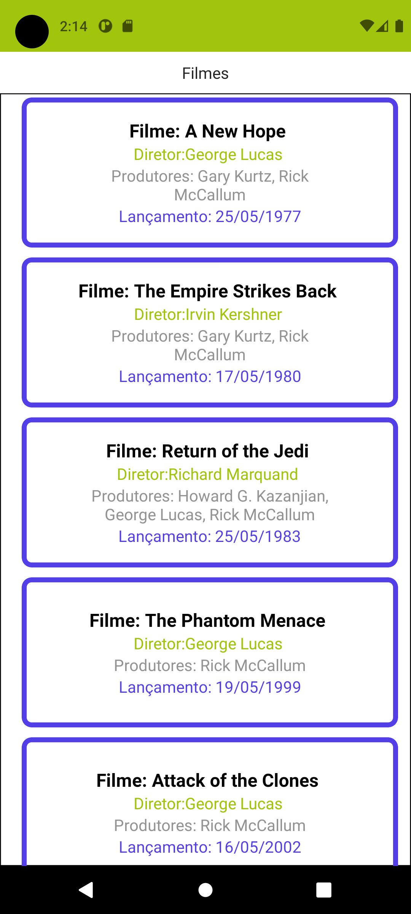

# DrhiaFilms
   
## Aplicativo de filmes

  

    
  

### Versão:
- Versão 1.3 atual - Correções no design e utilizando o hooks do react.

- Versão 1.2 - Melhorias do design.

- Versão 1.1 - Soluções de erros na leitura dos dados.

- Versão 1.0 - Apenas integração com API.

### Para utilizar o projeto veja algumas orientações abaixos:

 - Precisa instalar o nodejs lts `16.20.2`:
    baixe nodejs: https://nodejs.org/en/

 - Logo após ter instalado, digite no terminal ou cmd:
    
    `npm i` ou `yarn`
    
 - Depois digite: 
   
   `expo start` ou `yarn start`

 - Para versão mobile Android: 
    
    `npx expo run:android` ou `yarn android` 
    
 - Para versão mobile iOS:   
 
    `npx expo run:ios` ou `yarn ios`

 - Mais informações no site do React Native: 
    https://reactnative.dev/
    

